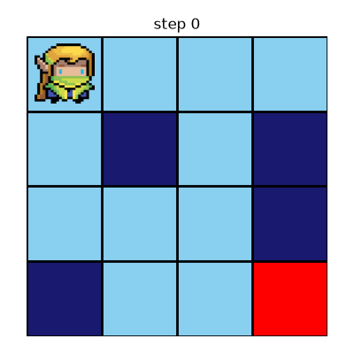

# QuantumRLJax (Quantum Reinforcement Learning in JAX)

## Contains

Reinforcement learning algorithms that use variational quantum circuits (VQCs) as function approximators.

- DQN in JAX, following [CleanRL](https://github.com/vwxyzjn/cleanrl) and [PureJaxRL](https://github.com/luchris429/purejaxrl). The q-value function is either a neural network (Flax) or a VQC (PennyLane), following [VQC-DRL](https://github.com/ycchen1989/Var-QuantumCircuits-DeepRL).
- Training scripts for gymnax environments and for the Frozenlake environment (see below for details).

### Examples

We run the DQN algorithm on the Frozenlake environment with the 4x4 map ($|\mathcal{S}| = 16$, $|\mathcal{A}| = 4$) using either a neural network or a variational quantum circuit as a parametrized function representation of the q-value function. In the following we show one episode of an agent following the random policy (no training), and the episodes of the agents following the corresponding trained policies (greedy policy w.r.t. the approximated q-value function):

| Random policy | DQN + neural network | DQN + VQC |
|:---:|:---:|:---:|
|  |  |  |

## Architectures

Both agents are trained with the same DQN loop and hyperparameters on Frozenlake (16 states, 4 actions). They differ in the q-value function and its input encoding.

| | Neural network (`dqn_frozen_lake.py`) | VQC (`dqn_vqc_frozen_lake.py`) |
|---|---|---|
| Input | one-hot encoding of the agent position (16 features) | binary encoding of the agent position (4 features, one per qubit) |
| Model | MLP 16 → 32 → 16 → 4, ReLU activations | 4 qubits, 4 variational layers |
| Output | one q-value per action | ⟨Z⟩ of each qubit + bias, one per action |
| Trainable parameters | 1140 = (16·32+32) + (32·16+16) + (16·4+4) | 52 = 4·4·3 rotation angles + 4 biases |
| Optimizer | Adam, learning rate 5e-4 | Adam, learning rate 1e-2 |

Parameters shared by both:

| Parameter | Value |
|---|---|
| Rewards (goal / hole / step) | 1.0 / -0.2 / -0.01 |
| Max episode steps | 100 |
| Total timesteps / max episodes | 25000 / 1000 |
| Replay buffer size / batch size | 1000 / 32 |
| Discount factor γ | 0.95 |
| Learning starts / train frequency | 1000 / 10 |
| Target network update (τ / frequency) | 1.0 / 1 |
| Exploration ε | linear decay 0.999 → 0.01 over the first 25% of timesteps |

**VQC.** Each qubit encodes one input bit with `RX(π·x)` and `RZ(π·x)`. Each variational layer applies a chain of CNOTs between neighbouring qubits followed by a trainable `Rot` gate on every qubit. The weights are initialised close to zero (σ = 0.01) and the bias at zero.

## Install

1. clone the repo
```bash
git clone git@github.com:riberaborrell/quantum-rl-jax.git
```

2. move inside the directory, create virtual environment and install required packages
```bash
cd quantum-rl-jax
make venv
```

3. activate venv
```bash
source venv/bin/activate
```


## Developement

in step 2) also install developement packages
```bash
make develop
```

## Frozenlake environment dependencies
1. clone the repo 
```bash
git clone ../git@github.com:riberaborrell/Frozenlake.git
```
2. install package in the virtual environment
```bash
pip install -e ../Frozenlake
```

## Usage

Every script takes its options from the command line (`--help` lists them).

```bash
python src/algorithms/dqn_frozen_lake.py        # dqn + neural network on Frozenlake
python src/algorithms/dqn_vqc_frozen_lake.py    # dqn + VQC on Frozenlake
python src/algorithms/dqn.py                    # dqn on a gymnax environment
python src/examples/run_frozen_lake.py          # roll out a random policy
python src/examples/run_trained_frozen_lake.py  # roll out a trained policy
```

Outputs (trained parameters, gifs) are saved under `src/data/<env>/<algorithm>/`.
